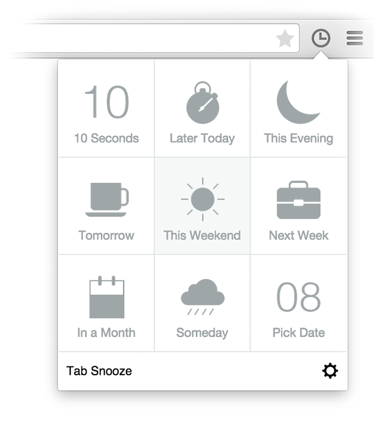

Tab Snooze
===========

> This project is now deprecated, and no longer maintained.
>
> Tab Snooze was a quick weekend hack as well as a class project. While it received substantial attention
> upon launch, I was unable to keep up maintenance. In the meantime, other projects, such as (the confusingly named)
> [Tab Snooze](http://www.tabsnooze.com/) extension by Eyal Wiener have gained popularity. Please consider such alternate options for now.
>
> If you are, however, interested in taking up this project, please post an issue to this repository indicating your interest.
> Thank you for your support — it's been a fun ride.

Snooze tabs for later.

[Download v0.2 Alpha](https://github.com/athyuttamre/tab-snooze/releases/tag/v0.2-alpha). Note that you have to side load it on `chrome://extensions` as explained [here](http://www.maketecheasier.com/manually-install-extensions-google-chrome/).
